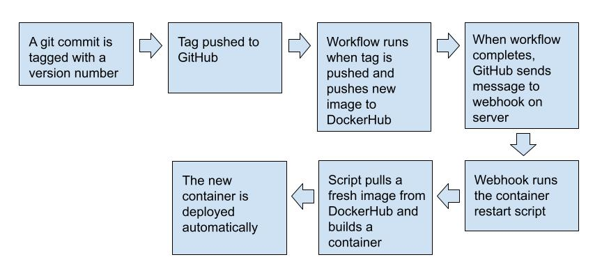

# Project 5 - CD

### Part 1 - Semantic Versioning

- This project uses `git tag` to add tags to the repository which will then be used by the `metadata-action` and the `build-push-action` to appropriately tag images that are being pushed to DockerHub. After that, utilizing a restart script and `webhook` on an EC2 instance to listen for a new image then pull it and deploy the new container automatically.

- To generate a tag for the repo:
    - `commit` the changes
    - run `git tag -a v<*.*.*> <commit hash> -m "<message>"`
    - run `git push origin v<*.*.*>` to push the tag and changes to GitHub.

- The workflow will run when a new tag is pushed to GitHub. This will eliminate extraneous images from being built and pushed to DockerHub: only ready versions will be pushed. The workflow pulls the tag from the GitHub metadata and uses it to tag the image sent to DockerHub.

- [DockerHub Repo](https://hub.docker.com/repository/docker/xjohnsonwsu/3120-cicd/general)

### Part 2 - Deployment

- The installation of Docker to the remote instance was the same as the installation to my personal laptop as they both run Ubuntu. See [README-CI: Run Project Locally](./README-CI.md#run-project-locally) for detailed instructions.
- The [container restart script](./deployment/pull-start.sh) is simple. It stops and removes the outdated container, so that the name can be reused. Then it pulls the fresh image from DockerHub and runs a container from the new image. During the operation, it provides output of status.
    - The script is located in `/var/scripts/`.
- To install `adnanh's webhook`, simply run `sudo apt install webhook`.
- The [webhook definition file](./deployment/hooks.json) simply has an `id` field to name the hook, an `execute-command` field to tell the hook what to do when activated, and the `command-working-directory` which tells webhook where to execute.
    - The webhook definition file is located in `/var/webhook`.
- `webhook` can be started manually with `webhook -hooks /path/to/hooks.json -verbose`.
- The [webhook service file](./deployment/webhook.service) includes a link to package documentation, a description, and intructions for the system to start the service. To start the service at boot so it is listening add `ConditionPathExists=/var/webhook` and `ExecStart=/usr/bin/webhook -nopanic -hooks /var/webhook/hooks.json -verbose` lines in the appropriate sections.
    - To reload the service when `webhook.service` is changed, use `sudo systemctl daemon-reload`.
    - To reload the service when `hooks.json` is changed, use `sudo systemctl restart webhook.service`.
    - This file is located in `lib/systemd/system/`.
- To configure GitHub to send a message to the listener, click on `Settings` from the repo main page. Then select `Webhooks` on the left sidebar, then click `Add webhook`.
    - Add the `Payload URL` to specify *where* to send the POST request.
        - This is supplied by webhook when activated on the server.
    - Select the event(s) that will trigger the webhook.
        - For this project, I selected `Let me select individual events.` > `Workflow runs`.
    - Click `Add webhook` to save.

- Demonstration Video uploaded to Pilot

### Resources Used

- [Install Docker Engine on Ubuntu - Install using the apt repository](https://docs.docker.com/engine/install/ubuntu/#install-using-the-repository)
- [adnanh's webhook docs](https://github.com/adnanh/webhook/tree/master/docs)
- [GitHub Docs - Webhooks documentation](https://docs.github.com/en/webhooks)